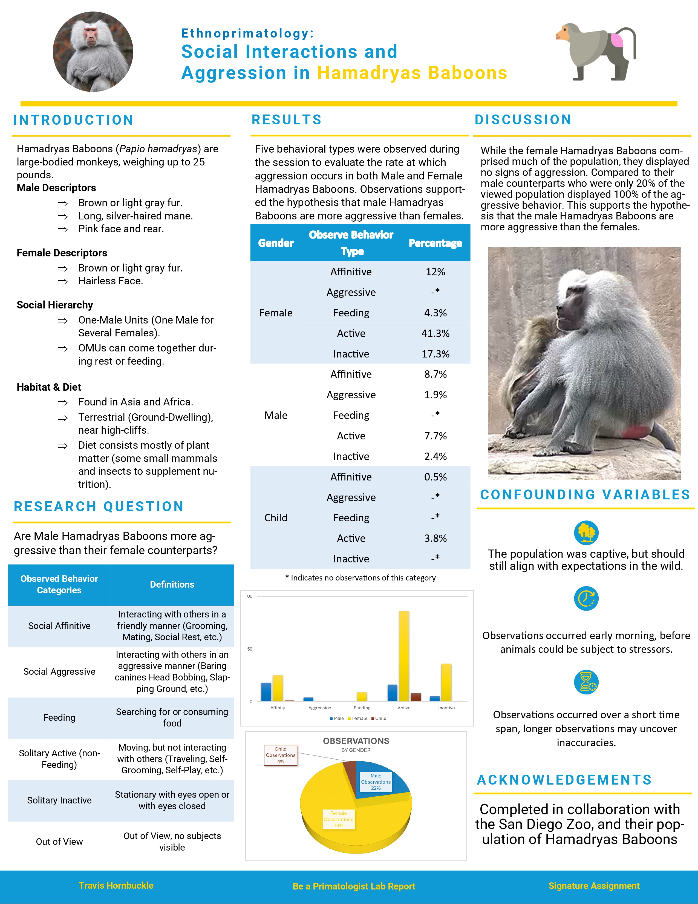

## **📝 Course Description**

An introduction to biological anthropology, one of the subfields of anthropology, and includes surveys of hominid fossils, primate biology and behavior, human biological variation, ecology and adaptation, and evolutionary theory.

## **🎯 Expected Outcomes**

- Describe and explain the field of anthropology, including the approaches and methods used by anthropologists (e.g. holistic approach, evolutionary approach, fieldwork, etc.)
- Describe and explain the scientific method, engage in its practice, analyze how anthropologists use the scientific method, evaluate empirical data and research, and apply scientific critical thinking into their everyday lives.
- Explain the unifying and diversifying principles of life, including the hierarchy of biological organization and apply these concepts to extant and extinct hominin and non-human primates and their ecosystems.
- Explain and analyze biological variation of extinct and extant hominin and non-human primate species and analyze the hypotheses of why these variations exist.
- Evaluate the patterns and processes of evolution, (e.g. how genes are inherited, microevolution and macroevolution, etc.) and analyze how evolutionary theory applies to extant and extinct hominin and non-human primates, including themselves.
- Describe and explain hominin and non-human primate biology, behavior, and ecology and analyze the impact of human activity on ecosystems.

## **📝 Course Syllabus**

<a target="_blank" rel="noopener noreferrer" href="/public/documents/ANTH1020-Syllabus.pdf">Click Here</a> to download a full copy of this course's syllabus.

## **✒️ Signature Project**

### **Be a Primatologist Lab Report**

<iframe src="https://slccbruins.sharepoint.com/sites/trle-1724079827/_layouts/15/Doc.aspx?sourcedoc={221960c2-cf2a-488b-8a9f-09130098e0e1}&amp;action=embedview" width="100%" height="600px" class="myIframe">

Hi SOF

</iframe>

### **Final Visual Aid in Support of Findings**

### **🪞 Course Reflection**

Throughout this class I feel that I have learned a significant amount about how humans have evolved over time. Prior to entering this class I didn’t feel that I knew much about the human evolutionary process other than the general information that I was taught when I was in high school. I feel that his course has given me a deeper understanding and build upon the foundations that I received in the past, providing further clarity into topics like genetic drift, tool use and material culture, or even thought about how a change in diet millions of years ago changed our biological capabilities – like the size of our brains. Some of the information, especially that of the scientific method, has tied in with both courses I have taken in the past like biology, as well as frequently throughout the course I would see information across several of my classes that are all in different disciplines. I feel that the information that I gained from this class has helped me become more knowledgeable in the study of evolution and reinforced my passion for archaeology!

I am a firm believer in the adage “To know where you’re going, you have to know where you’ve come from”. I think that understanding the origins of our species and other species that follow along in our development is important to project how we will continue to develop in the future. With the information that we continue to uncover about our history, I also think that we gain a deeper understanding of our current position in our developmental path. We gain an insight into why things are the way they are – like why our thumbs are as strong as they are compared to other species in the same genus.

As I mentioned above, I am very interested in archaeology for many reasons – the ability to look back and see the world through someone’s eyes that lived thousands of years ago is incredibly inspiring to me. Looking forward, though my current intended path doesn’t currently involve working as an anthropologist, I think that it would be an incredibly exciting and rewarding career that I would love to pursue in the future! With my current major being Psychology and moving to a University where I will be focusing on Developmental Psychology, I think that exploring a career in Psychological Anthropology would be a mix of my two favorite subjects!

